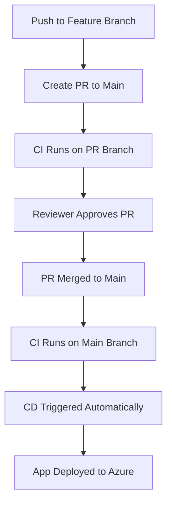

# DevOps CI and CD Pipeline for .NET API

## Overview

This project shows how to set up a DevOps CI and CD pipeline for a .NET 8 Web API running on Azure. It uses Azure Pipelines to automatically test, build, and deploy the app in a secure and reliable way. Along with making the /count API work, this project also follows good DevOps practices like:

* Isolated development through feature branches
* PR based CI enforcement
* Approval gates before merge to main
* Deployment to Azure App Service only after successful CI validation

## Project Details

* **App Name**: Counter API
* **Main Endpoint**: `/count`
* **Language**: C#, .NET 8
* **Repo Platform**: Azure Repos (Project: `Docosoft test assignment`)

## Infrastructure & Services

* **Azure App Service Name**: `decosoft-counter-app`
* **Resource Group**: `docosoft-assignment`
* **Service Connection Name**: `sunandan`
* **Service Connection Type**: Azure Resource Manager
* **Identity Type**: App Registration
* **Credential Type**: Workload Identity Federation
* **App Service Runtime**: .NET 8 (LTS), Linux
* **Region**: Canada Central

---

## 📁 Repository Structure

```
.vscode/                 # VS Code settings
src/                     # .NET source files
tests/                   # Unit tests
azure-build.yml          # CI pipeline definition
azure-release.yml        # CD pipeline definition
CounterApi.sln           # Solution file
LICENSE.txt              # License
README.md                # Project documentation
```

---

## CI Pipeline: `azure-build.yml`

This pipeline is responsible for validating and packaging the code.

### CI WORKFLOW:

1. **Trigger**: Runs on push to `main` and also validates PRs targeting `main`
2. **Restores dependencies** via `dotnet restore`
3. **Runs unit tests** to catch regressions
4. **Builds** the application
5. **Publishes** the output as a zipped artifact
6. **Uploads** the artifact named `drop` for downstream pipelines

### Full CI YAML:

```yaml
trigger:
  branches:
    include:
      - main
pr: none

pool:
  vmImage: 'ubuntu-latest'

variables:
  buildConfiguration: 'Release'

steps:
- task: UseDotNet@2
  inputs:
    packageType: 'sdk'
    version: '8.x'
    installationPath: $(Agent.ToolsDirectory)/dotnet

- script: dotnet restore CounterApi.sln
  displayName: 'Restore dependencies'

- script: dotnet test CounterApi.sln --verbosity normal
  displayName: 'Run unit tests'

- script: dotnet build CounterApi.sln --configuration $(buildConfiguration)
  displayName: 'Build the app'

- task: DotNetCoreCLI@2
  inputs:
    command: 'publish'
    publishWebProjects: true
    arguments: '--configuration $(buildConfiguration) --output $(Build.ArtifactStagingDirectory)'
    zipAfterPublish: true

- task: PublishBuildArtifacts@1
  inputs:
    pathToPublish: '$(Build.ArtifactStagingDirectory)'
    artifactName: 'drop'
    publishLocation: 'Container'
```

📸 **Recommended Screenshot**: Upload screen showing published artifact in CI run summary.

---

## 🚀 CD Pipeline: `azure-release.yml`

This pipeline deploys the build artifact from CI to Azure App Service.

### ✅ CD workflow:

1. **Trigger**: Automatically runs when CI on `main` succeeds
2. **Fetches artifacts** produced by the CI pipeline
3. **Uses the AzureWebApp\@1 task** to deploy the package

### Full CD YAML:

```yaml
trigger: none

resources:
  pipelines:
    - pipeline: buildPipeline
      source: docosoft-ci
      trigger:
        branches:
          include:
            - main

pool:
  vmImage: 'ubuntu-latest'

variables:
  webAppName: 'decosoft-counter-app'
  packagePath: '$(Pipeline.Workspace)/buildPipeline/drop/**/*.zip'

steps:
- task: DownloadPipelineArtifact@2
  inputs:
    buildType: 'specific'
    project: '$(System.TeamProject)'
    pipeline: 'docosoft-ci'
    artifact: 'drop'
    path: '$(Pipeline.Workspace)/buildPipeline/drop'

- task: AzureWebApp@1
  inputs:
    azureSubscription: 'sunandan'
    appType: 'webApp'
    appName: '$(webAppName)'
    package: '$(packagePath)'
```

📸 **Recommended Screenshot**: Azure App Service deployment logs from the pipeline run.

---

## 🔒 PR Workflow and Branch Policy implementation

### Git Workflow:

* Developers push code to `feature/general-updates*`
* A PR is created targeting `main`
* CI runs on the PR
* Merge allowed **only after approval** and **CI success**
* CI/CD triggers again after merge to `main`

📸 **Recommended Screenshot**:

* PR page showing approval and passing checks before merge

### Branch Policy Enforced on `main`:

* ✅ Require pull request
* ✅ Require reviewer approval
* ✅ Enforce successful build
* ✅ Auto-complete upon approval

📸 **Recommended Screenshot**: Azure Repos Branch Policies tab showing these rules.

---

## 🔄 End-to-End Workflow



---
## Thought Process & Design Decisions
* I chose Azure App Service because it's a fully managed platform that makes it easy to deploy and scale web applications without managing underlying infrastructure. I set up the App Service to align with the assignment requirements and ensure seamless deployment from Azure Pipelines. My focus was on building a secure and automated CI/CD pipeline that cleanly deploys to this infrastructure without manual intervention.

* I chose artifact-based deployment using zipped build outputs. This made it easier to separate build and release stages and ensured consistency in what gets deployed.

* For authentication, I used workload identity federation with an App Registration. This lets the pipeline connect to Azure resources securely without storing secrets, which aligns with enterprise-grade security standards.

* I selected the Canada Central region because it's geographically closer to Ireland, helping reduce latency while staying cost-effective.

* I preferred Azure Repos over other platforms to keep everything within a unified Azure DevOps ecosystem. This simplifies permissions, service connections, and automation setup.

* The CI pipeline is responsible for restoring packages, running unit tests, building the solution, and publishing a zipped artifact. The CD pipeline picks up the artifact and deploys it to the Azure App Service.

* Overall, I focused on keeping the setup modular, readable, and practical — just like how I’d approach a similar project in a real-world DevOps role.


---

## 📬 Contact

**Maintainer**: Sunandan Sekhar Das
**Azure DevOps Project**: [Docosoft test assignment](https://dev.azure.com/sunandan09/Docosoft%20test%20assignment)

---

📌 Tip: Place screenshots in a `/screenshots` folder in the repo and reference them in the README as Markdown images:

```md


```

For suggestions or improvements, please fork this repo and open a pull request.
