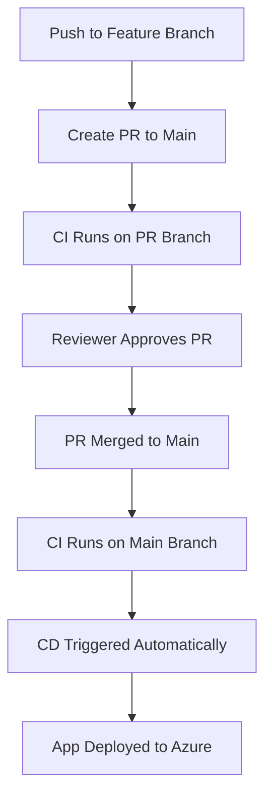

# DevOps CI and CD Pipeline for .NET API

## Overview

This project shows how to set up a DevOps CI and CD pipeline for a .NET 8 Web API running on Azure. It uses Azure Pipelines to automatically test, build, and deploy the app in a secure and reliable way. Along with making the /count API work, this project also follows good DevOps practices like:

* Isolated development through feature branches
* PR based CI enforcement
* Approval gates before merge to main
* Deployment to Azure App Service only after successful CI validation

## Project Details

* **App Name**: Counter API
* **Main Endpoint**: `/count`
* **Language**: C#, .NET 8
* **Repo Platform**: Azure Repos (Project: `Docosoft test assignment`)

## Infrastructure & Services

* **Azure App Service Name**: `decosoft-counter-app`
* **Resource Group**: `docosoft-assignment`
* **Service Connection Name**: `sunandan`
* **Service Connection Type**: Azure Resource Manager
* **Identity Type**: App Registration
* **Credential Type**: Workload Identity Federation
* **App Service Runtime**: .NET 8 (LTS), Linux
* **Region**: Canada Central

---

## 📁 Repository Structure

```
.vscode/                 # VS Code settings
src/                     # .NET source files
tests/                   # Unit tests
azure-build.yml          # CI pipeline definition
azure-release.yml        # CD pipeline definition
CounterApi.sln           # Solution file
LICENSE.txt              # License
README.md                # Project documentation
```

---

## CI Pipeline: `azure-build.yml`

This pipeline is responsible for validating and packaging the code.

### CI WORKFLOW:

1. **Trigger**: Runs on push to `main` and also validates PRs targeting `main`
2. **Restores dependencies** via `dotnet restore`
3. **Runs unit tests** to catch regressions
4. **Builds** the application
5. **Publishes** the output as a zipped artifact
6. **Uploads** the artifact named `drop` for downstream pipelines

### Full CI YAML:

```yaml
trigger:
  branches:
    include:
      - main
pr: none

pool:
  vmImage: 'ubuntu-latest'

variables:
  buildConfiguration: 'Release'

steps:
- task: UseDotNet@2
  inputs:
    packageType: 'sdk'
    version: '8.x'
    installationPath: $(Agent.ToolsDirectory)/dotnet

- script: dotnet restore CounterApi.sln
  displayName: 'Restore dependencies'

- script: dotnet test CounterApi.sln --verbosity normal
  displayName: 'Run unit tests'

- script: dotnet build CounterApi.sln --configuration $(buildConfiguration)
  displayName: 'Build the app'

- task: DotNetCoreCLI@2
  inputs:
    command: 'publish'
    publishWebProjects: true
    arguments: '--configuration $(buildConfiguration) --output $(Build.ArtifactStagingDirectory)'
    zipAfterPublish: true

- task: PublishBuildArtifacts@1
  inputs:
    pathToPublish: '$(Build.ArtifactStagingDirectory)'
    artifactName: 'drop'
    publishLocation: 'Container'
```

📸 **Recommended Screenshot**: Upload screen showing published artifact in CI run summary.

---

## 🚀 CD Pipeline: `azure-release.yml`

This pipeline deploys the build artifact from CI to Azure App Service.

### ✅ CD workflow:

1. **Trigger**: Automatically runs when CI on `main` succeeds
2. **Fetches artifacts** produced by the CI pipeline
3. **Uses the AzureWebApp\@1 task** to deploy the package

### Full CD YAML:

```yaml
trigger: none

resources:
  pipelines:
    - pipeline: buildPipeline
      source: docosoft-ci
      trigger:
        branches:
          include:
            - main

pool:
  vmImage: 'ubuntu-latest'

variables:
  webAppName: 'decosoft-counter-app'
  packagePath: '$(Pipeline.Workspace)/buildPipeline/drop/**/*.zip'

steps:
- task: DownloadPipelineArtifact@2
  inputs:
    buildType: 'specific'
    project: '$(System.TeamProject)'
    pipeline: 'docosoft-ci'
    artifact: 'drop'
    path: '$(Pipeline.Workspace)/buildPipeline/drop'

- task: AzureWebApp@1
  inputs:
    azureSubscription: 'sunandan'
    appType: 'webApp'
    appName: '$(webAppName)'
    package: '$(packagePath)'
```

📸 **Recommended Screenshot**: Azure App Service deployment logs from the pipeline run.

---

## 🔒 PR Workflow and Branch Policy implementation

### Git Workflow:

* Developers push code to `feature/general-updates*`
* A PR is created targeting `main`
* CI runs on the PR
* Merge allowed **only after approval** and **CI success**
* CI/CD triggers again after merge to `main`

📸 **Recommended Screenshot**:

* PR page showing approval and passing checks before merge

### Branch Policy Enforced on `main`:

* ✅ Require pull request
* ✅ Require reviewer approval
* ✅ Enforce successful build
* ✅ Auto-complete upon approval

📸 **Recommended Screenshot**: Azure Repos Branch Policies tab showing these rules.

---

## 🔄 End-to-End Workflow



---
## 🎯 Thought Process

I approached this project like I would in a real DevOps role, with reliability, clarity, and automation at the center.

* The `.NET 8` codebase was provided, so I took full ownership of setting up the cloud environment. I chose **Azure App Service** because it's scalable, managed, and integrates smoothly with Azure DevOps.

* I wanted **zero manual steps**, so I built a fully automated pipeline that handles everything from code validation to deployment. This included setting up secure authentication using **Workload Identity Federation** — no secrets, just clean trust-based access.

* I have written the **CI pipeline** in such a way which ensures the app is always production safe. It restores dependencies, runs unit tests, builds the app, and publishes a versioned artifact. It's triggered by PRs and merges to `main`, ensuring every build is traceable.

* I set up the **CD pipeline** to only trigger on successful CI runs. It pulls the exact artifact that passed validation and deploys it to the App Service. Clean separation of concerns, here i am following a good devops practice.

* I picked **Canada Central** as the deployment region, it’s close to Ireland where I am based, which helps with performance and mirrors how I would approach region selection in practice.

* Everything is stored and versioned in **Azure Repos**, keeping the entire workflow inside the Azure ecosystem — simple, consistent, and secure.

---

## 🧠 Design Decisions
* **CI Pipeline Design**: I structured the CI pipeline to be a gatekeeper. It restores dependencies, runs tests, builds the solution, and publishes a deployable artifact — all within a single pipeline. I made sure it's triggered only when needed (on PRs and merges to main) to keep builds efficient and relevant. The CI pipeline ensures that every change is validated before being considered safe for deployment.

* **CD Pipeline Design**: The CD pipeline is intentionally minimal and reliable. It simply pulls the artifact that passed CI and pushes it to Azure App Service.  This separation avoids duplication and makes the deployment process predictable and simple.

* **Azure App Service (Linux, .NET 8)**: I chose Azure App Service for its developer-friendly platform-as-a-service model, which means i dont have to take care of the infrastructure and lets me focus purely on pipelines. Combined with native scaling and logging, it gives me a good platform to deploy the web app.

* **Artifact-based deployment**: I opted to generate zipped artifacts in CI to make my CD pipeline fast, predictable, and repeatable. It allows me to treat builds as immutable release units.

* **Workload Identity Federation**: Instead of relying on stored secrets, I implemented a secretless authentication flow using workload identity federation. It's secure, modern, and aligns with how enterprise systems handle access at scale.

* **Azure Pipelines**: I deliberately chose Azure Pipelines for its deep integration with Azure services, YAML file support, and seamless service connection with my Azure App Service. It let me script and visualize the entire pipeline lifecycle from one place.


This setup helped me to deploy the applciation following good DevOps practices, balancing simplicity, and security.

---

## 📬 Contact

**Maintainer**: Sunandan Sekhar Das
**Azure DevOps Project**: [Docosoft test assignment](https://dev.azure.com/sunandan09/Docosoft%20test%20assignment)

---

📌 Tip: Place screenshots in a `/screenshots` folder in the repo and reference them in the README as Markdown images:

```md


```

For suggestions or improvements, please fork this repo and open a pull request.
