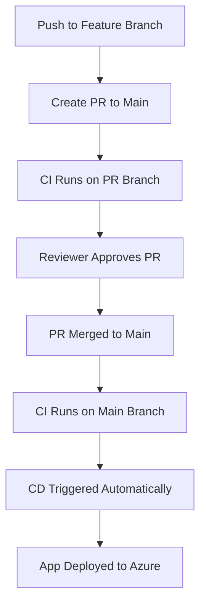

# DevOps CI and Pipeline for .NET API

## Overview

This repository showcases a real-world DevOps CI/CD pipeline implementation for a .NET 8 Web API, hosted on Azure. The main goal is to demonstrate automated, secure, and scalable build and release workflows using Azure Pipelines. In addition to meeting the functional needs of the `/count` API, the project emphasizes best practices such as:

* Isolated development through feature branches
* PR-based CI enforcement
* Approval gates before merge to main
* Deployment to Azure App Service only after successful CI validation

## Project Details

* **App Name**: Counter API
* **Main Endpoint**: `/count`
* **Language**: C#, .NET 8
* **Repo Platform**: Azure Repos (Project: `Docosoft test assignment`)

## Infrastructure & Services

* **Azure App Service Name**: `decosoft-counter-app`
* **Resource Group**: `docosoft-assignment`
* **Service Connection Name**: `sunandan`
* **Service Connection Type**: Azure Resource Manager
* **Identity Type**: App Registration
* **Credential Type**: Workload Identity Federation
* **App Service Runtime**: .NET 8 (LTS), Linux
* **Region**: Canada Central

---

## 📁 Repository Structure

```
.vscode/                 # VS Code settings
src/                     # .NET source files
tests/                   # Unit tests
azure-build.yml          # CI pipeline definition
azure-release.yml        # CD pipeline definition
CounterApi.sln           # Solution file
LICENSE.txt              # License
README.md                # Project documentation
```

---

## 🔧 CI Pipeline: `azure-build.yml`

This pipeline is responsible for validating and packaging the code.

### ✅ What Happens in CI:

1. **Trigger**: Runs on push to `main` and also validates PRs targeting `main`
2. **Restores dependencies** via `dotnet restore`
3. **Runs unit tests** to catch regressions
4. **Builds** the application
5. **Publishes** the output as a zipped artifact
6. **Uploads** the artifact named `drop` for downstream pipelines

### Full CI YAML:

```yaml
trigger:
  branches:
    include:
      - main
pr: none

pool:
  vmImage: 'ubuntu-latest'

variables:
  buildConfiguration: 'Release'

steps:
- task: UseDotNet@2
  inputs:
    packageType: 'sdk'
    version: '8.x'
    installationPath: $(Agent.ToolsDirectory)/dotnet

- script: dotnet restore CounterApi.sln
  displayName: 'Restore dependencies'

- script: dotnet test CounterApi.sln --verbosity normal
  displayName: 'Run unit tests'

- script: dotnet build CounterApi.sln --configuration $(buildConfiguration)
  displayName: 'Build the app'

- task: DotNetCoreCLI@2
  inputs:
    command: 'publish'
    publishWebProjects: true
    arguments: '--configuration $(buildConfiguration) --output $(Build.ArtifactStagingDirectory)'
    zipAfterPublish: true

- task: PublishBuildArtifacts@1
  inputs:
    pathToPublish: '$(Build.ArtifactStagingDirectory)'
    artifactName: 'drop'
    publishLocation: 'Container'
```

📸 **Recommended Screenshot**: Upload screen showing published artifact in CI run summary.

---

## 🚀 CD Pipeline: `azure-release.yml`

This pipeline deploys the build artifact from CI to Azure App Service.

### ✅ What Happens in CD:

1. **Trigger**: Automatically runs when CI on `main` succeeds
2. **Fetches artifacts** produced by the CI pipeline
3. **Uses the AzureWebApp\@1 task** to deploy the package

### Full CD YAML:

```yaml
trigger: none

resources:
  pipelines:
    - pipeline: buildPipeline
      source: docosoft-ci
      trigger:
        branches:
          include:
            - main

pool:
  vmImage: 'ubuntu-latest'

variables:
  webAppName: 'decosoft-counter-app'
  packagePath: '$(Pipeline.Workspace)/buildPipeline/drop/**/*.zip'

steps:
- task: DownloadPipelineArtifact@2
  inputs:
    buildType: 'specific'
    project: '$(System.TeamProject)'
    pipeline: 'docosoft-ci'
    artifact: 'drop'
    path: '$(Pipeline.Workspace)/buildPipeline/drop'

- task: AzureWebApp@1
  inputs:
    azureSubscription: 'sunandan'
    appType: 'webApp'
    appName: '$(webAppName)'
    package: '$(packagePath)'
```

📸 **Recommended Screenshot**: Azure App Service deployment logs from the pipeline run.

---

## 🔒 PR Workflow & Branch Policy

### Git Workflow:

* Developers push code to `feature/*`
* A PR is created targeting `main`
* CI runs on the PR
* Merge allowed **only after approval** and **CI success**
* CI/CD triggers again after merge to `main`

📸 **Recommended Screenshot**:

* PR page showing approval and passing checks before merge

### Branch Policy Enforced on `main`:

* ✅ Require pull request
* ✅ Require reviewer approval
* ✅ Enforce successful build
* ✅ Auto-complete upon approval

📸 **Recommended Screenshot**: Azure Repos Branch Policies tab showing these rules.

---

## 🔄 End-to-End Workflow



---

## 🎯 Outcome & Thought Process

This project simulates how a DevOps engineer in a real organization would set up:

* **Safe DevOps pipeline** with approvals, test gating, and main protection
* **Artifact-based release** that ensures only tested builds reach production
* **YAML-as-code philosophy** for full traceability and versioning
* **Separation of CI and CD** to enhance observability and auditability

---

## 📬 Contact

**Maintainer**: Sunandan Sekhar Das
**Azure DevOps Project**: [Docosoft test assignment](https://dev.azure.com/sunandan09/Docosoft%20test%20assignment)

---

📌 Tip: Place screenshots in a `/screenshots` folder in the repo and reference them in the README as Markdown images:

```md


```

For suggestions or improvements, please fork this repo and open a pull request.
